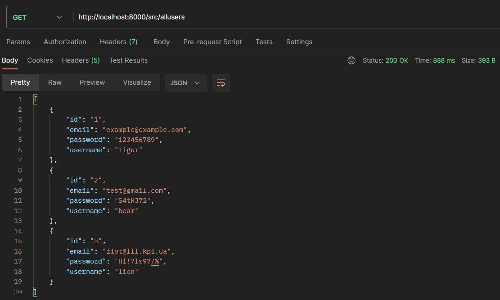
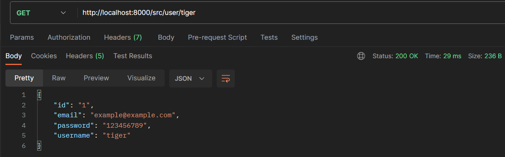
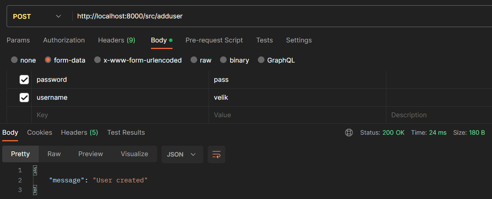
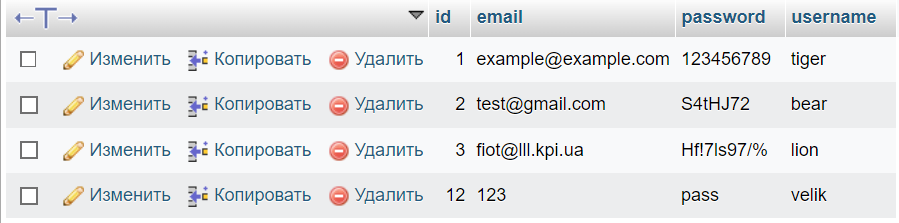
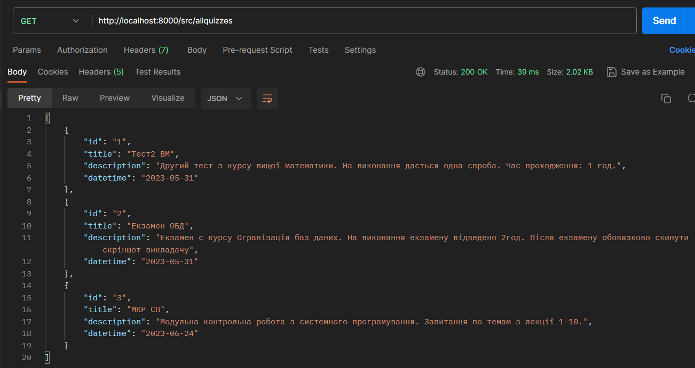
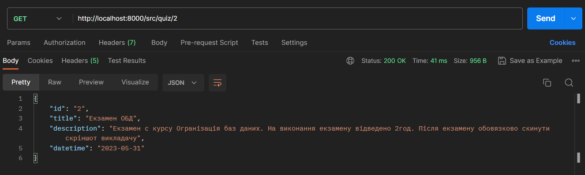
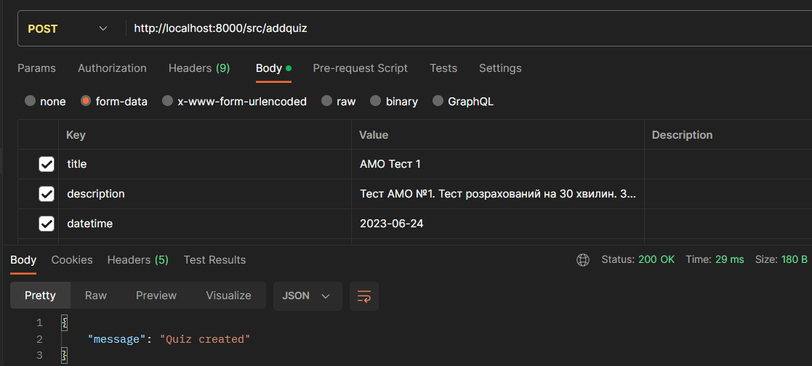
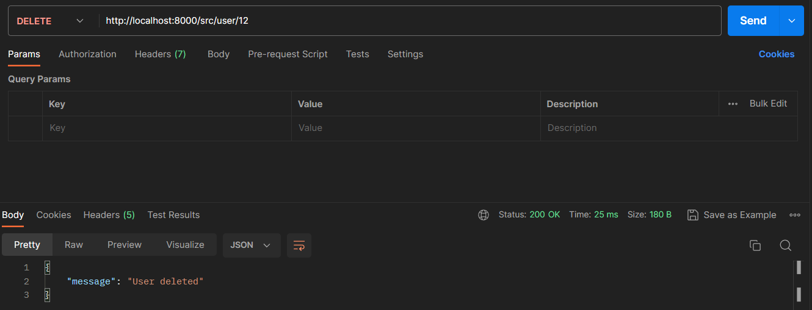
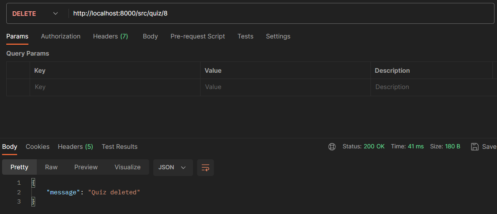
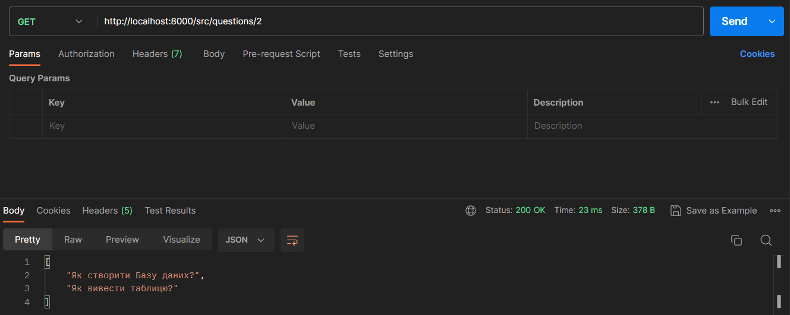

# Тестування працездатності системи

*В цьому розділі необхідно вказати засоби тестування, навести вихідні коди тестів та результати тестування.*

Для тестування api наша команда використовувала застосунок Postman. Було створено 9 різних запитів використовуючу мову програмування PHP та бібліотеку slim.

# 1. GET Вивидення всіх користувачів (/src/allusers)

# 2. GET Вивидення певного користувача (/src/user/{name})

# 3. POST Додавання нового користувача (/src/adduser)

Перевірка нового користувача в БД

# 4. GET Вивидення всіх тестів (/src/allquizzes)

# 5. GET Вивидення певного тесту за айді (/src/quiz/{quiz_id})

# 6. POST Створення нового тесту (/src/addquiz)

# 7. DELETE Видалення певного користувача з бд (src/user/{user_id})

# 8. DELETE Вивидення певного тесту за айді (/src/quiz/{quiz_id})

# 9. GET Вивидення питань по певному тесту (/src/questions/{quiz_id})

